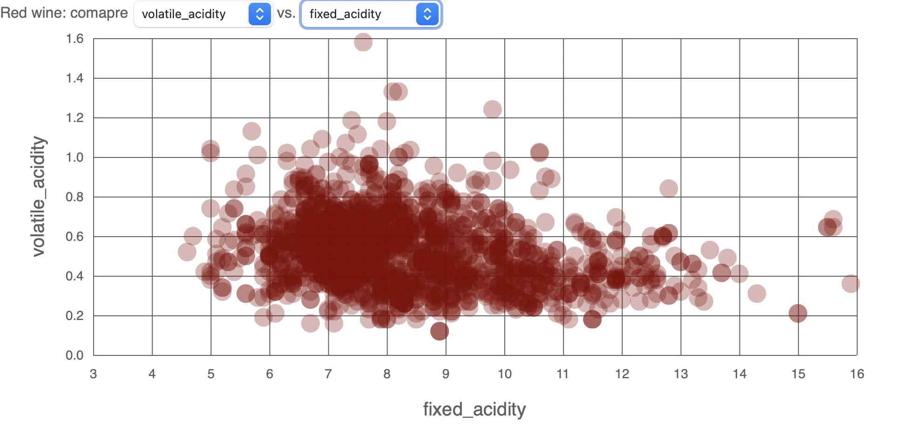

# Example interactive bar chart
This repository demonstrates an example of an interactive scatterplot using D3 and JS. It visualizes red wine data by a user-selected x and y attribute. 

## About the data
The graph uses data from the UCI Machine Learning Repository - [Wine Quality](https://archive.ics.uci.edu/ml/datasets/wine+quality) data set. The file `datatransform.py` located in the [extra](https://github.com/sophiacofone/wine2/tree/main/extra) folder simply combines the red and white wine data into a single csv. 

## Interactive Bar Chart
Click on the dropdown menus to select attributes to compare! [Scatterplot](https://sophiacofone.github.io/wine2/).

